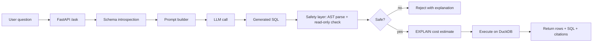

# Architecture — dataask

## High-level flow



## Components

| Component | Stack | Notes |
|---|---|---|
| Server | FastAPI | `/ask`, `/health`, `/schemas` |
| NL→SQL | OpenAI gpt-4o-mini default | Schema injection in system prompt |
| Safety | sqlglot AST | Block any non-SELECT / multi-statement |
| Connection layer | DuckDB v0.1, more coming | Pluggable adapter pattern |
| Web UI | Next.js + Vercel | Chat thread + SQL preview + execute button |
| Eval suite | `evalstack` | 50 hand-curated cases |

## Safety layer details

```python
# server/safety.py — conceptual
import sqlglot
from sqlglot import expressions as exp

def is_readonly(sql: str) -> tuple[bool, str]:
    try:
        parsed = sqlglot.parse_one(sql, read="duckdb")
    except Exception as e:
        return False, f"unparseable: {e}"
    if not isinstance(parsed, exp.Select):
        return False, f"non-SELECT statement: {type(parsed).__name__}"
    # also reject if there are multiple statements
    statements = sqlglot.parse(sql, read="duckdb")
    if len(statements) != 1:
        return False, "multi-statement input not allowed"
    return True, "ok"
```

## Why DuckDB first

- Free local execution, no warehouse setup
- Supports Postgres-compatible queries (sqlglot can re-dialect later)
- Public datasets (NYC Taxi, Chinook) load in seconds
- Trivial to add Postgres/Snowflake/BigQuery adapters once the safety layer is solid
